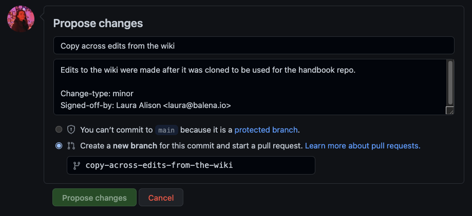

# Balena Handbook Manual
If there is information missing here on how to do something that you think would be useful to the team or that you yourself want to know how to do, either add it to the repo yourself, create an issue requesting it or you can ask anyone on the team for help (jellychat, 1-2-1s, /beginners or /teamos flow)

*Note: Until the release party for docs has been completed, the docusarus website version of the handbook is not deployed. However, all changes made to the handbook will be reflected on the website once live.*

**Other resources**

[Github Skills](https://skills.github.com/) - Learn how to use Github with interactive courses designed for beginners and experts

[Contributing to balena docs guidelines](https://github.com/balena-io/docs/blob/master/CONTRIBUTING.md#creating-commits-in-line-with-semantic-versioning) - We have a few guidelines which will allow your PR to pass our CI checks and successfully merge. 

## House Keeping
- Keep all file names in the balenaltd/handbook repo lower case with dashes separating words (with the exception of the README.md). Please don't use any other symbols as naming conventions.

- When making changes, please leave clear and detailed commit messages and descriptions so it's easy to understand what that change was and why that change was made.

**Desired commit message format**
```
[First line with easy to understand description of change] 
[Optional line with more description]

Change-type: (e.g. [major, minor, or patch](https://github.com/balena-io/docs/blob/master/CONTRIBUTING.md#creating-commits-in-line-with-semantic-versioning))
Signed-off-by: Your Name <Youremail@balena.io>

branch-name-example
```

Here's an example of a great commit message:



You can learn more about the differences in change types [here](https://github.com/balena-io/docs/blob/master/CONTRIBUTING.md#creating-commits-in-line-with-semantic-versioning)

## Editing the content of the repo

### Editing directly on github
You can find the written content of the handbook within the 'docs' folder.

Go to the markdown file you want to edit and click on the pencil icon in the top right to begin editing the page.

Make your changes, write your commit message and branch name and select the 'propose changes' button.

A pull request will be created and another member of the team will need to review your changes first, before it's committed to the handbook repo.

Reviews can be carried out by any other team member, so just ask! You can either ask someone directly or add a reviewer on the pull request itself (use the cog icon in the reviewers box on the top right).

You can see your pull request by visiting the pull request tab on the handbook repo and clicking on it from the list.

Once your PR has been reviewed, hit the merge pull request button. This may already have been done for you by your reviewer, but it's worth checking.

#### Formatting tips
```
**bold**
*italic*
<u>underlined</u>
<strike>strike through</strike>

# heading1 (there should only ever be one of these on a page - this is the main title of the page)
## heading2 (smaller than heading 1)
### heading3 (smaller again)
.etc

[link text](www.the-url-you-want-to-link-to.com)

```
#### Ordering
The contents on the website defaults to the alphabetical order of the file names (not the H1 title of pages), prioritising captial letters first (which is why we want to keep all file names in lowercase).

In the instance you need to override the positioning of a page / folder, you can use the snippet below and change the number weighting depending on the order needed. This starts from '0' at the top, the higher the number the lower down it will sit on the contents order. 

```
---
sidebar_position: 0
---
```

*Note: The 'Welcome' page should always sit at the top of the contents*

#### Adding Assets and Images
To add assets and images you will need to add your the file to the docs/assets folder in the repo. 

Once done, user the following format to add it to your chosen location in the markdown:

```

```

*Note: An exception - to add assets to this README.md file (the handbook manual) you will need to add your image to the static/img folder and use the following format:*

```

```

### Editing from the website version of the handbook (Docusarus)
Once the website version has been deployed, you will be able to get to the corresponding markdown file in the github repo via the 'edit this page in github' link/button at the bottom of each webpage. 


This will take you to github to make your edits as detailed above.

## Website

This handbook website is built using [Docusaurus 2](https://docusaurus.io/), a modern static website generator.

### Installation

```
$ yarn
```

### Local Development

```
$ yarn start
```

This command starts a local development server and opens up a browser window. Most changes are reflected live without having to restart the server.

### Build

```
$ yarn build
```

This command generates static content into the `build` directory and can be served using any static contents hosting service.

### Deployment

Using SSH:

```
$ USE_SSH=true yarn deploy
```

Not using SSH:

```
$ GIT_USER=<Your GitHub username> yarn deploy
```

We're using GitHub pages for hosting, this command is a convenient way to build the website and push to the `gh-pages` branch.
