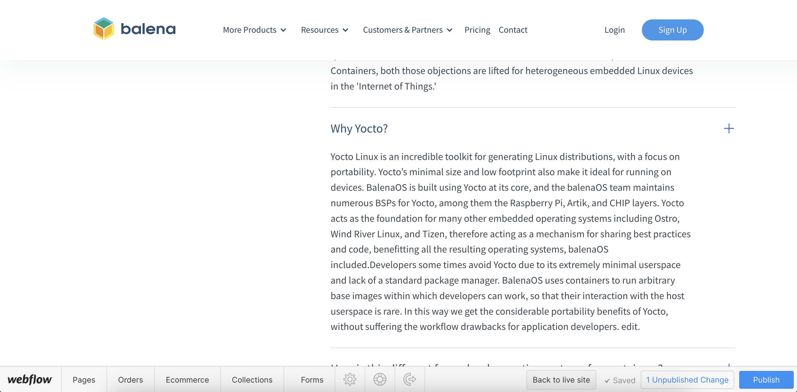

# Marketing Site: How To

The [balena.io](https://www.balena.io/) marketing website is built in [Webflow.io.](https://webflow.com/)

Hosting & redirects:
* The balena.io website is hosted by webflow
* The balena blog (URL: [blog.balena.io](https://blog.balena.io/)) which can be found at [balena-io/balena-blog](https://github.com/balena-io/balena-blog), it is hosted by Cloudflare.
* The EFP and success screens for etcher are hosted at [https://efp.balena.io](https://efp.balena.io) using Cloudflare and can be found at balena-io/etcher-efp
* Individual docs for each product are hosted on Cloudflare using Flowzone and are published using Docusaurus.
* All the 301 redirects which relates to balena.io domain are in webflow and all the other redirects are served via the blog.balena.io

The owner of the balena marketing site is @lizzieepton but you can also ping @marketing-site in Zulip.

## How to raise issues & Bugs

If you notice any bugs, broken links or other issues which need to be fixed immediately please add a task to the [Fibery Project Board](https://balena.fibery.io/Marketing_Aspect/Marketing-Site-Project-Board-519), link it to the 'Marketing Site' component, and add the label ‘bug’ to the issue. This notifies the core website maintainers and will be picked up and fixed immediately. Please make sure you give as much detail as possible on the issue you have noticed, including screenshots, the URL of the page and the device you viewed the issue on.

You can also create tasks to suggest an improvement that you would like the website team to consider, this could be related to user experience, updated text, new page sections/content, etc. Although you are welcome to get access to Webflow and make changes yourself, if you aren’t comfortable, don’t have the time or feel your change is something that needs to be discussed before being made, please open an issue.

## How to view and contribute to the Roadmap 

You can find the roadmap for improvements and new page additions to the website on [the Fibery Project Board.](https://balena.fibery.io/Marketing_Aspect/Marketing-Site-Project-Board-519) The to-do list is regularly reviewed and ordered in terms of priority with top priority improvements being at the top of the to-do list.

Major improvement milestones will be discussed during marketing brainstorms. If you have a proposed on page or new page improvement please raise it for the brainstorm before adding a task to the roadmap. Please make sure you tag the component as ‘Marketing site’ when you create a task related to the website in Fibery.

## How to use Webflow

### Content Editing Access

Allows you to edit the copy on the page, you can’t edit the page structure

How to use this: 
1. Request access from Ops, this will be access via Bitwarden from a shared content editors account.
2. Logging in: go to balena.io?edit this will open the editor window for you to login.

3. Once logged in you will be able to click on all editable elements and change the content. This is the view you should have:

4. At the bottom left corner you can navigate to other pages of the site to edit them

5. Once you have made your edits, the publish button will appear in blue, telling you how many changes you have made, click publish, this will make your changes live on the marketing site immediately. 
6. If you haven’t already done so, open an issue on the balena-site repo detailing what you have changed, assign it to yourself if you made the changes, add the relevant label and close the issue at this point. This is important so that we can see what changes were made at what time, if we need to roll back the site for any reason we will have a history of what will need to be edited again after the roll back. It also allows the website team to see what changes have been made and for what reason. Closed issues will be shared in the weekly all hands.

### Design Access

Please ping @marketing in Zulip to discuss the design changes you want to make before requesting design access to make sure the website team knows that you will be working on the site. If you have not used Webflow before please ping to ask for a call to go over the basics of editing. With design access you can edit everything on the site, this includes creating new pages, page structure, page design and content. Lots of elements across the site are the same, if you have design access please be aware that editing the design of something on one page could break it on another page.

If you have requested design access this will be given to you from your own account, this is because if another person logged into a shared account at the same time as you it would log you out mid edit. 

If you log in and have a restricted view you can check if someone else has design access at the top hand corner of the screen, it will say you have ‘Editor access’ and who has design access at that time. You can ping that person in Zulip to check they are actively working on the site and if they don't, request design control from them using Zulip, this will automatically transfer to you in 30 seconds if they do nothing.

#### Publishing workflow with design access

Before you publish anything to the main site, you must publish to the staging site first:

1. Publish to staging site, the last person to publish will likely have published to both staging and our live site, you need to untick the balena.io option so that you are only publishing to staging as shown in the image below.

2. Check the staging site, visit [https://balena-io-2-0.webflow.io/](https://balena-io-2-0.webflow.io/) and make sure your edits look and behave as you expect them too, check that the rest of the page you are working on is still working as expected and check two other pages to make sure you haven’t broken an element on another page.
3. Once you are happy with your changes on the staging site, back in webflow publish to both staging and balena.io. Once published check your changes again on balena.io. 

4. If you haven’t already done so, open an issue on the balena-site repo detailing what you have changed, assign it to yourself if you made the changes, add the relevant label and close the issue at this point. This is important so that we can see what changes were made at what time, if we need to roll back the site for any reason we will have a history of what will need to be edited again after the roll back. It also allows the website team to see what changes have been made and for what reason. Closed issues will be shared in the weekly all hands.

### Tips for designing in Webflow

1. If you are building a new page, the easiest way to get started is copying and pasting sections from another page and editing the content. 
2. If you want to edit an element that has been copied from another page, either duplicate the class and rename it following the naming convention if you are going to be making major changes, or add a second class to the element which is common if you want to make a change such as `left-align` or `top-margin`.
3. If you are creating a new section from scratch, start with a `section` element followed by a div given the class `Wrapper` this will automatically keep your content within the page boundaries on different sized screens 
4. Make sure you check what your edits look like on all screen sizes which you can toggle between at the top of the page, any edits you make at laptop screen size will carry through to other sizes, but edits made at smaller screen sizes will only affect screens smaller than them and vice versa for bigger screens.
5. If you are creating a new page and it isn’t ready to go live, leave it in draft mode, even if you don’t publish to the live site another person might be making edits to another page and when they publish to a live site all changes will be made public no matter who made them. Because of this, make sure all your changes are published before you end a session editing the site.

## Other things related to the website

### EFP & The Etcher Success Screen
The Etcher Featured Project page and Etcher Success screen can both be found and developed in [this repo](https://github.com/balena-io/etcher-efp). You can read more about the [EFP 2.0 improvement here](https://docs.google.com/document/d/1t-Mf6ZHsxbTojI_CtzuXxk7feZA1LDzCe-8ZO2djQ6E/edit?usp=sharing), and find both static sites by visiting: 
EFP: [https://www.balena.io/etcher/featured/](https://www.balena.io/etcher/featured/) 
Etcher Success: [https://www.balena.io/etcher/success](https://www.balena.io/etcher/success) 

### Contact-Sales page, contact forms and recaptcha

### Sign-up form

### Status Button

### Etcher/OS/Engine Downloads

### The website analytics client 

Flowzone website uses balena analytics-client [https://github.com/balena-io-modules/analytics-client](https://github.com/balena-io-modules/analytics-client) to report its analytics. The snippet code is manually transpiled into es5 and then minified before being added to webflow (on Projects Settings > Custom Code). The code adds a page view to all load events and adds a ‘click’ event to all anchor tags into html, so if the generated code by webflow for a button/clickable does not generates a <a> tag, no click event will be fired. It is also important to notice that the current analytics-client only publishes to NPM and we rely on [https://www.jsdelivr.com/](https://www.jsdelivr.com/) to make the final bundle available through a CDN.

### The balena Public Roadmap
The balena public roadmap can be found at [https://roadmap.balena.io/](https://roadmap.balena.io/) It is built and hosted by Fider. You can find the improvement for the roadmap [here](https://docs.google.com/document/d/1YBP0nSzuxRNIj5u7OC1c9rTnJIMxfAJnZIls4ia_7mA/edit?usp=sharing).

It is linked to from the marketing site and balena.io/roadmap has been set-up through webflow to redirect to the roadmap site.
