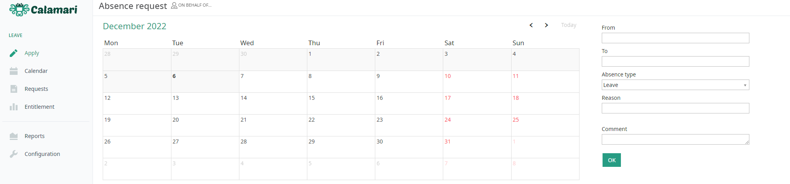
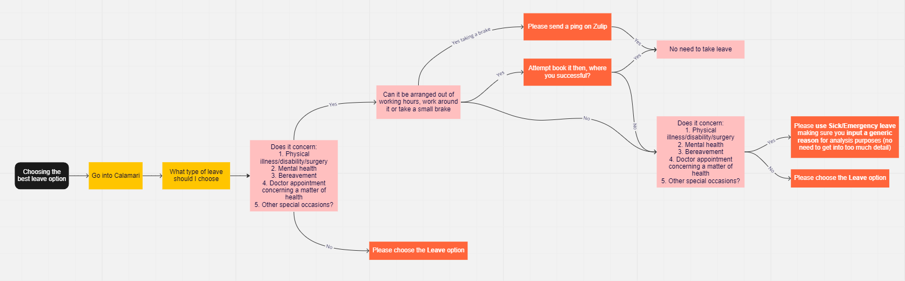

# Sick and Emergency Leave Policy

## Introduction
We understand that there will be times when you have to deal with unexpected issues and circumstances beyond your control.  
We practice radical candor, which means that we trust you to use sick and emergency leave days as and when you need to. As such, we offer unlimited sick & emergency leave and the system is set to auto approve every request. 
We are always available if you need assistance and please be aware that we periodically review sick and emergency leave requests so if there is a need someone from teamOS may reach out to you for feedback, to offer assistance or guidance.

## Best practice

We offer all team members flexible working hours and understand if they need to change their normal working hours or take a few hours off, when something unexpected comes up, while within their scheduled working hours. For example, if you need to collect your child from school when they’re sick or need to deal with a situation urgently, etc. 
We understand too that you may need to take a couple of hours off, and there’s no need to request a sick/emergency leave day. Please keep in mind that if you’re missing a meeting, or a support shift, it’s important to let the relevant members of the team know you’ll be AFK (away from keyboard) for a few hours and block your calendar so the team is aware. Additionally, if you think the situation will take longer than a couple of hours to deal with, consider putting in sick/emergency leave for half of the day, or a full day if it's possible you need it. Please note that we work flexibly and the need to ‘make up’ for these hours is mainly under your discretion, taking into account time sensitive work and/or further tasks that could block other team members or work. 

The sick & emergency leave policy is in place to help the team out when they need more time away from work due to personal and/or emergency circumstances. This allows you to take time off for these unforeseeable occasions, lets you rest and get better if you’re sick, or look after and spend time with family and loved ones when dealing with a difficult situation.

We have adopted a non restrictive - flexible leave policy, so that each team member feels empowered to take the necessary time needed to meet their needs and ensure their well-being. We trust that you are aware of your needs and where your specific situation lies, but if you have any questions or require any guidance on how to categorize your leave request, please reach out to teamOS. 

### Examples
These are a few examples of  sick & emergency leave best practice use. Please bear in mind that the list is not exhaustive, however it should provide some context of what we consider acceptable use of sick & emergency leave.

* Sudden or unexpected physical illness - you or a family member that you need to take care of
* Mental health - we encourage you to take time off when you need it to recuperate and avoid burnout
* Bereavement - you lost a loved one and you need time off to grieve, be with your family and/or make arrangements
* Emergency doctor’s visit - having to attend an emergency appointment or wait for one
* Accident - an unfortunate incident that happens to yourself, a dependent or your property, unexpectedly and unintentionally, typically resulting in damage or injury.
* Other special occasions, child’s performance, family member’s condition or emergency situation, military obligations, jury duty, etc

What we wouldn’t consider sick/emergency leave best practice:

* Routine scheduled doctor or examination appointments
* Going to the gym
* Vacation
* Getting eyebrows done
* Spa visits
* Tennis lessons
* Going to a concert
* Getting your pet groomed

## How to request sick & emergency leave

When requesting sick & emergency leave we use the third party tool [Calamari](../tooling/calamari.md). What we need from you is to:

1. Fill in the text boxes with the dates you will be absent, 
2. Use the drop down menu to select “Sick/Emergency leave” as Absence Type.
3. Include a reason for the absence, as well as a comment if applicable. 

This is to let us know what’s going on, how long you might be off, if there’s anything we can do to help and also inform our leave data. We would encourage you, if relevant, to use one of the defined list above e.g. mental health. 

However, we would urge you to let us help you if you’re going through a difficult time, are concerned about your ability to work for health and/or personal reasons, or if you are going to need to be off work for an extended period of time (more than two weeks). 

You can start by leaving a relevant comment on the text box (as seen in the snippet below), but also please reach out to a member of teamOS to discuss how best we can help you and accommodate your situation.

For more detailed instructions around Calamari, please see the [leave section in the Handbook](leave-policy.md).

This is what you will see in Calamari:

Choosing the appropriate Leave type:

