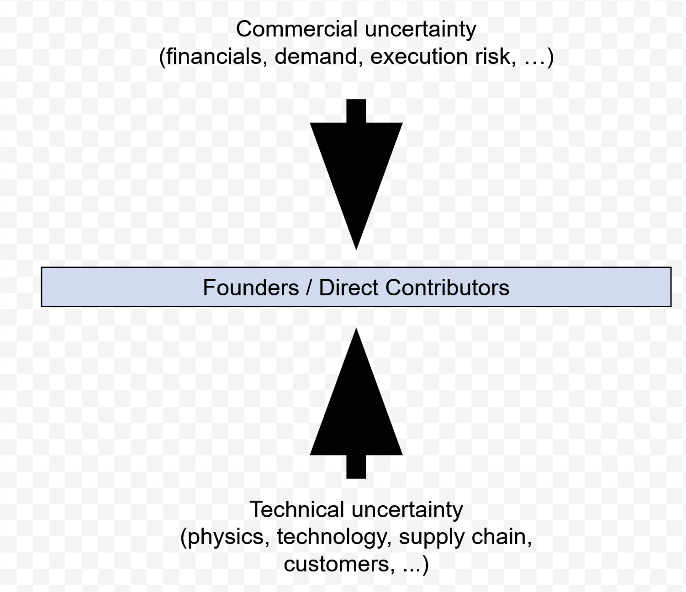
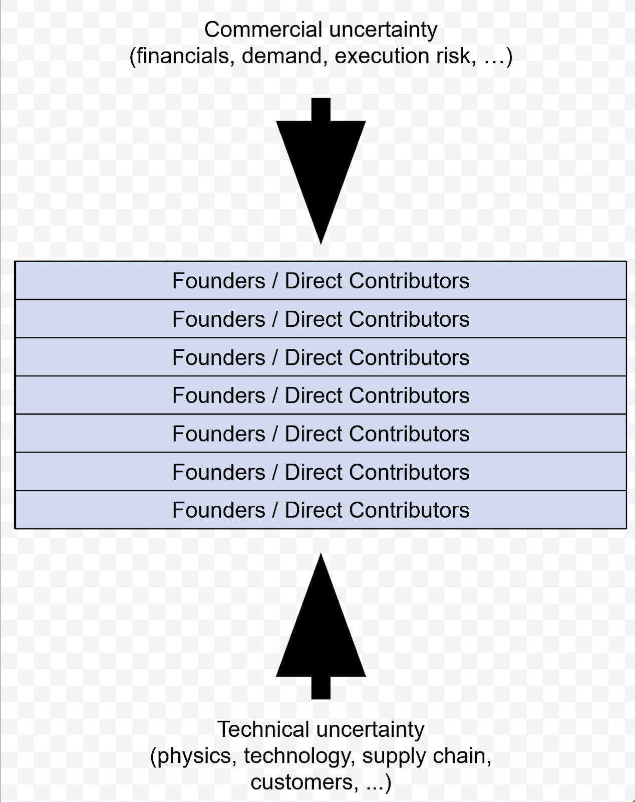
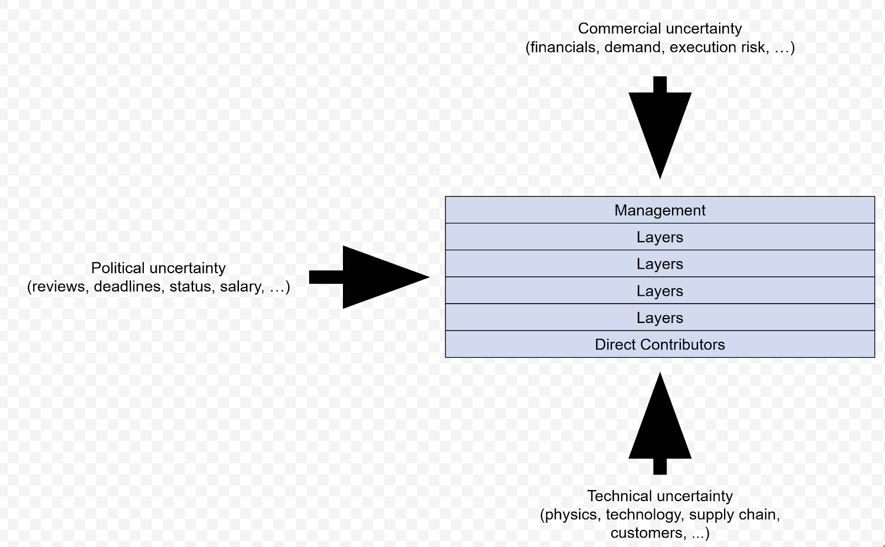
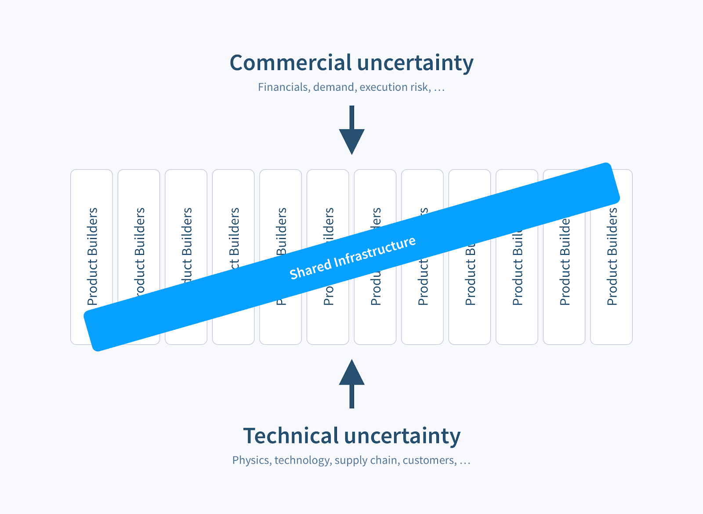

# A company of product builders

To help illustrate what it means to be a Product Builder and why it’s important, let’s follow the lifecycle of a company. 

When the company first starts, the team consists only of the founders. The founders are all direct contributors, and therefore directly experience all of the technical uncertainty and nitty-gritty details that come with building a new product. The founders are also the only interface to the external world, so they are directly exposed to the commercial uncertainty of raising funds, acquiring customers, etc. 

Hopefully the company finds some early success and continues to grow, adding more team members beyond the initial founders. The hope is that all new team members will be as equally motivated and involved as the initial founders.

But of course, [this rarely happens](https://en.wikipedia.org/wiki/Principal%E2%80%93agent_problem), and instead the organization begins to resemble something more like a traditional hierarchy. Here, the “management” layer is exposed to commercial uncertainty, and individual contributors are exposed to technical uncertainty. In an attempt to bridge this gap and “protect” the rest of the team from commercial uncertainty, more and more layers of management are introduced, and a new type of uncertainty, let’s call it “political” uncertainty, is introduced.

This new layer of management and political uncertainty abstracts away the commercial uncertainty and external realities from the team, and abstracts away the technical uncertainty and implementation details from management. This layer adds review, deadlines, and all sorts of other distortions in order to ensure the direct contributors are engaged and productive on a constant basis. At the same time, management gets removed from the hard realities of product development, and becomes increasingly focused on concepts that aren’t connected to the reality on the ground. 

This also introduces tension between management and direct contributors. Management feels that they are taking on a heavy burden on behalf of the rest of the team, that they bear all the external risk and stress in order to keep the team productive, but meanwhile they don't actually have the opportunity to produce anything themselves, and thus lose touch with what it feels like to be a direct contributor. Direct contributors, on the other hand, have the opportunity to build things, but can get disconnected from the broader mission and context, and may feel like their work is not appreciated. They start getting a feeling that management has no idea what’s going on and what actually matters, and develop a sense that things could be done better, even if it's not clear to them how. Everybody feels misunderstood, hurt, and emotionally exhausted, and aren’t even able to speak the same language. Sounds… less than ideal. 
 
## Our solution
What if, instead, we abandon the concept of abstracting one or the other group away from any kind of uncertainty? What if we create a company made up of people who are in touch with both commercial and technical uncertainties, even as it scales? Anyone can experience more or less from one or the other depending on their work/role but nobody is completely abstracted away, and everybody has at least some of both of the high-level vision and the low-level understanding of what they are building. So let's create a group of Product Builders!

Product Builders are placed at the very center of the company having clear visibility to internal and external elements that make up the company and its mission. Supported by a shared infrastructure (productOS), they are able to make meaningful contributions focusing on their own growth, share knowledge to strengthen the team and support each other to progress, as well as continue adding value and having a positive impact on our common vision and goals. 

We think that creating a company of product builders is the best way to achieve our mission. We also think it’s the best way to build a scalable, antifragile, omni-win-win organization where work is fulfilling, engaging, and meaningful. 