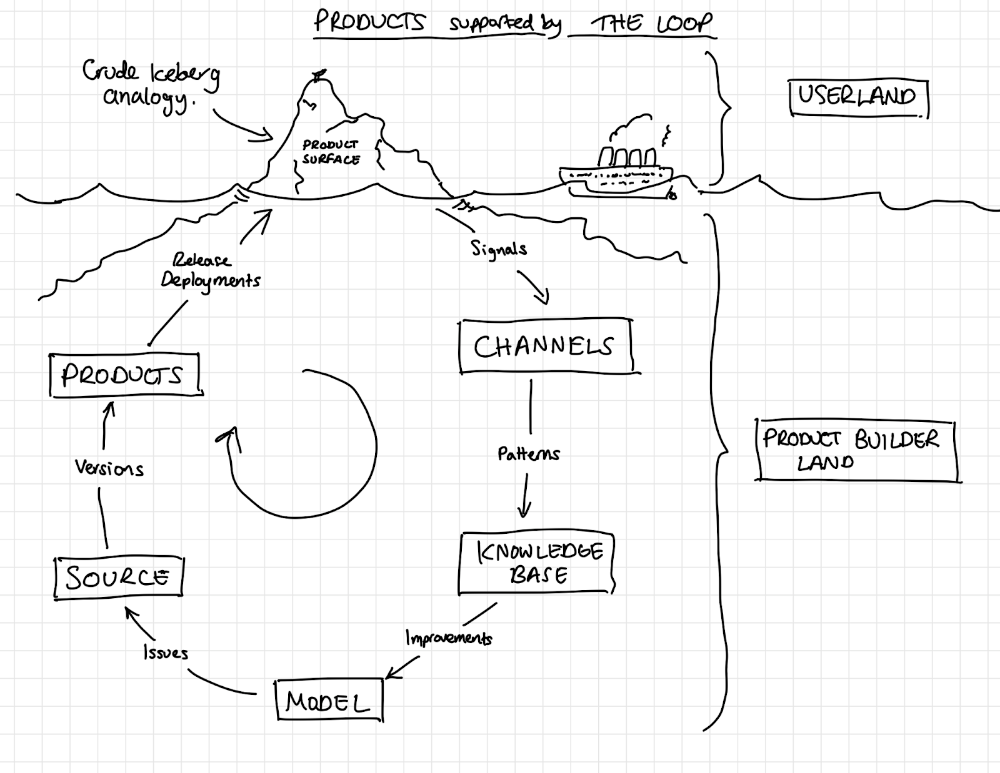

# Being a product builder
At balena, "the loop" is our framework for continuously improving products. Being a "Product Builder" means using the loop to build and improve products. A Product Builder is the profile of an ideal balenista that we all aspire to. 

The concept of being a product builder allows people with a huge variety of skill sets to apply what they know to work that they’re passionate about in an unrestricted way. No matter what you’re doing, whether your strength is in operations, commercial, engineering, finance, distribution, hardware, software, support, or elsewhere, we are all leveraging our unique skills and domain expertise to build better products. And not just the obvious products we build for our users, but the products, processes, and experiences we build for ourselves as well. Each and every team member at balena is therefore an aspiring Product Builder.

Together, Balena is a collective of Product Builders honing our craft. We are helping each other and sharing our knowledge along the way. We are expanding our understanding by trying many different things and learning from the results. We are open to failing and disagreeing if it helps us improve. We are constantly updating our collective intelligence and providing one another with mutual assistance. We are all aware of the external realities and broader context we operate in, and are also familiar with the details of what, exactly, we are building. We are confident and curious, aware of our limitations but also how to circumvent them. We are motivated to solve harder and harder problems, and to use the knowledge gained to build valuable products for ourselves and for our users - to build things that have never been built before. 

A product builder's job is to run a personal loop on repeat to continually iterate and improve their product. In order to create a feedback loop, product builders are not afraid to make mistakes, as fearing them gets in the way of progress. Mistakes are to be celebrated just as successes are. When a mistake is made this eliminates a path to tread creating a clearer route forward.

## Characteristics

### Look into the void
Product builders make the best decisions at the time based on the information available in order to decide the future of the product. They communicate, gather information and willingly enter into discussions to inform and help their decision making. They accept that these decisions will not always be the right ones, but are able to take ownership and learn from them.

### Define the roadmap
A roadmap is how product builders are able to clearly outline what the intended future could look like for the product. During ideation stages it’s easy to be so inundated with ideas for a route forward that scope and prioritization can spiral out of control. Product builders map out their product’s journey to plan and communicate how it will grow and set expectations. But just like any form of travel, plans are subject to change - and during the journey of building a product, the more information that’s gathered will ultimately dictate the order of importance for milestones. A roadmap is a source of truth to return to so any necessary pieces can be rearranged without losing valuable ideas.

### Set goals
In order to make progress through the loop, product custodian/builders create and set goals to aim for. Product builders shouldn’t be striving to reach a deadline at the expense of the outcome, but there is great value in having a point in time to work towards. The ability to prioritize incremental and larger milestones, set a goal to aim for, and to organize resources to achieve that goal is key to creating momentum. Having goals gives us the opportunity to reflect when reached: Was my timeline too ambitious? Too cautious? Why did we fail to reach that goal at that time? Why did we achieve far more than we expected to in the time? How can this information help to shape future goals and expectations going forward?

### Pursue the mission
A product builder regularly reviews their product objectively and reflects to ensure that it remains on track with its mission statement and to identify hairballing early on. Are we adding too many features? Are there multiple problems being caused by the same underlying issue? Is this leaning closer to bespoke over generic use cases? Is this still high value? Is it as simple as it could be? 

### Execute your vision
Product builders should be able to execute on their vision for their product without the concern of too many stakeholders. Depending on the products that interface with or have dependencies on the product, there are decisions that will likely need wider input. A product builder is considerate of this, however, they understand that the core vision of what the product is or should be will always take precedence over specific use cases. If a product builder finds themselves at the mercy of too many stakeholders, they understand it’s likely that the product is hairballing and moving away from the definition of a product. 

### Gather feedback
The best way to gather feedback is for a product to be used by its intended audience. Product builders can only hope to reduce friction for their users by directly understanding their users' needs. Product builders are antifragile in putting the success of their product above their own bias, prepared that their own assumptions about the product may be disproven and that it will impact upon the route the product takes. Adaptability is key. Whilst they should always pay attention to signals and patterns in feedback, they should equally work to identify XY problems and apply first principles (what a user might think they want may not be the feature they need) to try to ensure that the product maintains a high ‘product score’ and continues to serve the generic use case. 

### Autonomous development
With a well defined product having clear interfaces comes the freedom for product builders/custodians to act autonomously within their own product. It unlocks the freedom to move quickly -- fast development cycles, decisions without requiring input from many external stakeholders, allowing the product custodian to execute upon their vision for the product with minimal friction.

## How do I level up as a Product Builder? 
* Live in the personal loop - reflect, reflect, reflect
* Solve increasingly difficult problems at higher levels of abstraction
* Enable the team to do more with fewer resources 
* Practice and hone the Product Builder principles 
* Help others become better Product Builders 