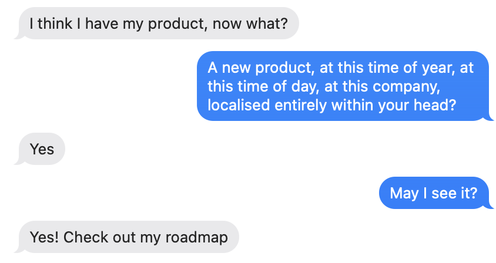

# I think I have my product, now what?

*Image source: ‘steamed products’ by @chrisys and @poshrolls*

## Testing your intuition using balenaHub
We can use balenaHub as a sanity check to help us create and identify products. This means that balenaHub is serving as a marketplace for products; if a project is mature enough to list on balenaHub, i.e. it hits a reasonable number of the characteristics that make a good product, it would be feasible to publish it there. If a product was lacking a readme, a name, a logo, and any documentation, obviously publishing it on hub would be a waste of time as nobody would know what to do with it. Currently we have the concepts of ‘Fleets’,  'Apps', and ‘Blocks’. Each one of these entities serves to encourage product creation, but we don’t have to limit ourselves to these three (e.g. we can add Transformers, Base images, OSs, Kernel Modules, Device type support, libraries, and more).

This does not mean 'does my product fit on hub as a fleet/app/block today?' but rather 'if I were to offer it on hub and it did fit within one of the available paradigms, would it make sense?'.

If something is a product, it should make sense that it be published on hub to increase visibility and allow someone to learn about and use that thing. Again, if it’s a very specific and non-generic software library, it wouldn’t make sense to publish it on hub as nobody else would be able to use it, but if it’s defined and architected correctly, it would make sense to publish it.

## Communicate
We’re product builders, and so we should be able to work with each other to figure out what is a product and what isn’t. We can work together to dehairball, productize and ultimately contribute to each other’s products as well. 

Work in the open. Use the tools we have available to sanity check and make sure we’re putting effort into products of value that align with the mission. Submit items to brainstorm calls, ask your buddy or guide, or even just a @team ping on Flowdock.

There’s no right or wrong answer, we know we have more work to do here to dehairball, figure out what products we’re building, to improve visibility into each other’s work, and to prioritize our efforts to align with the wider balena vision and roadmap.
