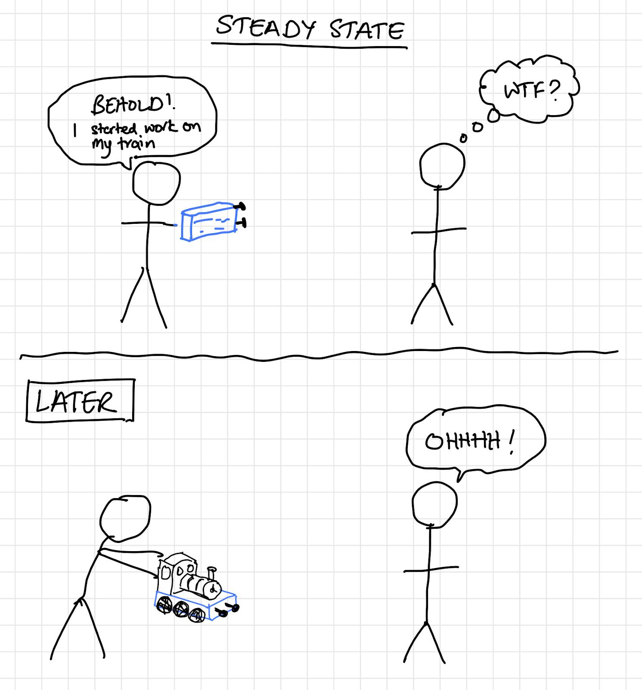

# Product lifecycle & custodianship
Our aim should always be to drive products toward feature complete, maintenance only mode. On the road to that destination, there are many opportunities for different people to pick up products, add value, and put them back down. The idea is that a product builder does not have to stay with the same product for its entire lifespan; products can have different custodians throughout their life.

## Steady state

The state in which a product can change custodians is known as a ‘steady state’. This means a state where the product can be ‘put down’. This means a healthy, documented state where the context can easily be shared and can be loaded by someone completely new, i.e. it can be picked up again easily. Development can stop, but the last version of the product should have value and continue to be useful. It doesn’t mean that further development and improvements can’t happen at a later date, but they aren’t required in order for the product to have value today.

A steady state doesn’t have to mean that a product is 100% feature complete and bug and maintenance free. A steady state can exist at many places throughout the lifecycle, with the common characteristic that it should be possible to apply an anytime algorithm. That means that when in steady state, the product should be in a situation where someone can at any time pick it up, quickly get up to speed, drive it forward, contribute value, and put it back down. As such, this means that there are many plausible steady states within the lifecycle of a product, and whilst in that state, the product can easily change custodians because there is no unimplemented context. This could be a strong proof of concept, a product ready to go to market, or simply a well formed and complete improvement. All have value.

Let’s explore the example of a carpenter building a wooden toy train from scratch. If there were a complete set of plans and instructions drawn up and ready to build, that would be a steady state where one person could stop and another could continue. If the builder were to hammer some nails into a board and leave that for the next custodian to continue from, it wouldn’t be clear what on earth they were intending to do next, and their efforts would be wasted. If they were to take that board and nail and continue developing it into one complete part of the train chassis, the next builder would be able to see that’s a complete part of the plan, pick it up and continue working with it to build the next part.

A product builder can “pick up” a new or existing product, become its custodian, improve it until it reaches steady state (either for the first time or the Nth time), and then “put it down” again to change focus and move onto the next product whilst another motivated custodian can continue their work.

## Stages in the product life cycle

### Raw ideas
A product starts with a raw idea; we connect patterns to form ideas and observe a requirement.

### Alpha/prototyping
Prove the concept, understand if an idea is viable or actually works. Ideas that have the start of a spec, connected patterns, and a proof of concept. Something you’d take to a hack week.

### Beta
Building towards viable. First iteration of a product, a working loop, iterating, developing, functional, usable.

### MVP
Working product, hot and fresh out the kitchen. Someone seeing or finding the product at this stage should be able to get an understanding of what it is and what problem it solves very easily.

### Stable
Feature complete, maintenance only mode, but still handled mostly internally.

### Mature
Feature complete, maintenance only, receiving external contributions

### Revenue generating
The product generates so much value for its users that they’re willing to pay to use it.
