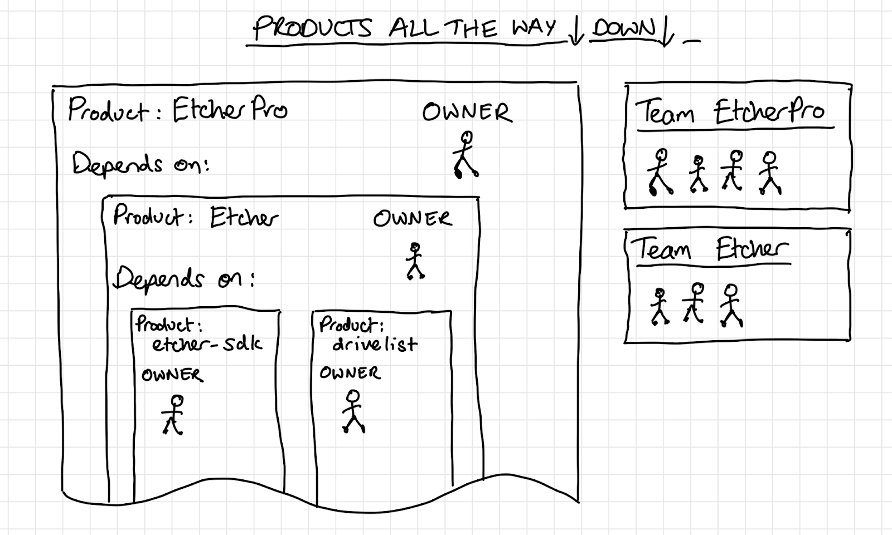

# Products built from products

You’d be forgiven for thinking that the approach of productization means that we’ll all end up working in an isolated way on individual products, but due to the fact that products can interact with, encompass, and even depend upon other products, that’s not the case. We want to work towards a world where each product can stand on its own merits when necessary, but at the same time it can also be a fundamental part of another, larger product. Of course, a larger product will be made up of many smaller products, naturally forming a cluster of people who collaborate.

This means that it’s entirely possible to have groups of people, all working together towards the mission for one specific product, and still each have their own product within that one. Being the custodian of a product doesn’t mean that you operate in a vacuum; an important part of product ownership is interacting with the world to understand needs/requirements, gather feedback, provide support, and agree on interfaces.

The outcome of this is that we are still all working together in pursuit of the balena mission, and can organize ourselves into smaller clusters around our products within the wider group.