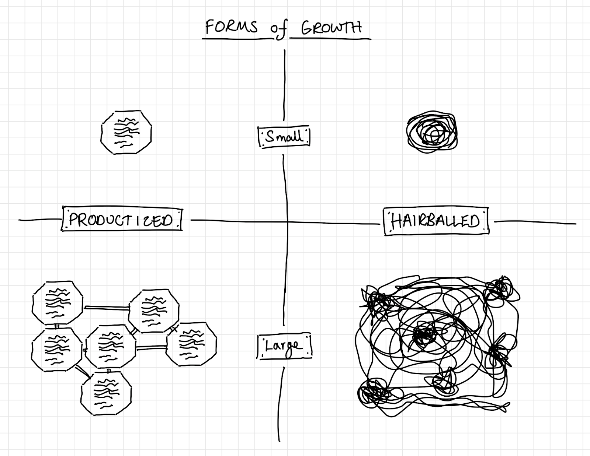
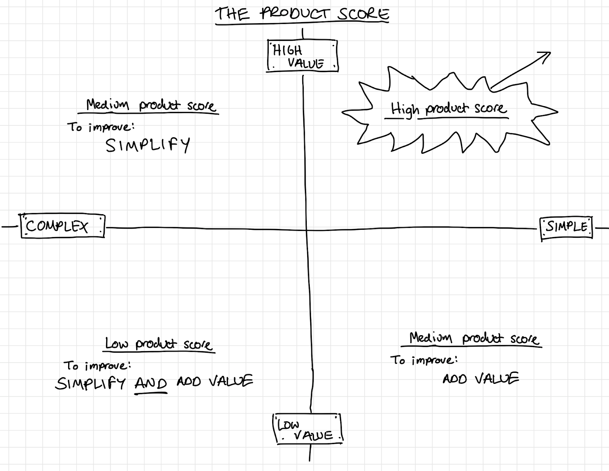

# What is a product?

**Wikipedia says:** *a product is an object or system made available for consumer use; it is anything that can be offered to a market to satisfy the desire or need of a customer.*

Whilst we agree with this, our definition works to expand on the above in order to help us to understand the approaches we should take when defining, carrying out and promoting the work we do at balena. It’s worth noting that we are also users and customers of our own products; we build for ourselves as well as our users.

Besides being something that can be offered as a means to satisfy the desire or need of a user, a product should take into account the resources and infrastructure required to keep it alive and maintain a steady state. These characteristics can be used to help identify products as well as helping to establish new products and transition existing projects into becoming their own product.

## Well-defined
A product should be able to have an ‘Explain like I’m five’ mission statement, and from that mission statement it should be easy to determine not only what that product does, but what it does not do. It should be easy to explain where it fits in the world and what it offers. If something is hard to explain it’s a good sign that it’s not well defined and perhaps needs to be modularised, broken down into other, smaller parts (which could also become products), so that the resultant description for each of them is a simple elevator pitch.

## Clear Interfaces
A product should have clear, defined interfaces with the rest of the world. We use the word interface in the most generic sense of the term. As in:

> *A point where two systems, subjects, organizations, etc. meet and interact*

In the case of software-based products, this could mean an API, a user interface, or an exposed set of methods. The important thing is that the boundary where the product stops and the outside world begins is well defined and understood both by the builders and the users of the product.

Once established, interfaces should be respected and changes to them carefully considered and published (e.g. using the semantic versioning approach) in order to maintain compatibility with the world outside the product and all of the existing users.

## Useful standalone
A product should be useful to anyone with a relevant use case, even outside of the context of balena. This means that we must always be solving for the generic use case. We are not unique and so the chances are that if we’re solving a problem, there will be other people out there trying to solve the same thing. If a problem looks unique to us, it’s likely to be a signal that we need to break apart what we’re doing into smaller pieces - unraveling the hairball. The product should have availability and general usefulness such that anyone can pick it up, try it, and adopt it for their use case.

An example of something not useful standalone is the balenaCloud dashboard. It is a component of balenaCloud, but is not useful outside of that context -- a user cannot take the dashboard and apply it to their own problem, because it’s very specific. However, if we were to break apart the dashboard such that it could be automatically generated by tools (products!) such as autoUI and Rendition, we’ve created something that solves for the generic use case of providing a user interface for a given backend API definition that we are simply users of ourselves.

## Can rely on other products
In the case of a software product, it could depend on other libraries or modules that are products in their own right. In the case of hardware, it could depend on integrated circuits, motors, or other components that too are products in their own right. This is a necessity in the avoidance of creating hairballs that can’t be picked apart. Products should be broken down into smaller products where at all possible to increase modularity, split responsibility and reduce complexity.

## Brand/Logo/Documentation
A product can have its own branding and logo. As with the other characteristics, even if this isn’t a priority, it should make sense that the product could have its own branding and logo. It wouldn’t make sense to brand something which isn’t a product and doesn’t solve the generic use case, because people won’t be able to apply it to their use case anyway, so why promote it?

A product can have its own landing page/marketing site that describes what it is, what it does and promotes its use. Information and documentation should be provided to communicate the purpose and describe how people can apply the product to their use case.

## Community
It stands to reason that if something is a product, it should be possible to build a community around it. It should be possible to have discussions, exchange ideas, submit issues, and get support. A product can have its own ambassadors that want to spread the word and communicate the usefulness to the world - this isn’t possible if it’s not solving for the generic use case! The community should be singing the praises of your product, contributing to and improving it, promoting it, and defending it.

## Build the best or use the best
A product should be the best at solving its own problem. If there are other products on the market that do the same thing, why aren’t we using them? If the answer isn’t essentially ‘because it’s rubbish’, we probably shouldn’t be building it. If the answer is ‘I could make it better / add a feature’ - why not contribute to improving that product? If the foundation is already there, we should help to make it better rather than creating something new. 

## Manageable growth
When products are small, ownership and custodianship are possible. You can hold small things in your hand and see all around them. You can see how they interact with the world and what interfaces they have, and obtain a holistic view with relative ease by virtue of their size. Large, unwieldy hairballs are hard to pull apart, and you can’t view all aspects of them at once. You can’t pick them up and look at them.

*(Diagram inspired by [Léon Krier](https://www.amazon.co.uk/gp/product/0262512939/ref=dbs_a_def_rwt_bibl_vppi_i2) - Duplication vs Hypertrophy)*

Due to this, it’s in our interests to keep products small as our organization grows. This means taking opportunities and making the effort to separate things out into their own products when they start to become too large to easily hold all the context necessary for anyone to understand the mission and contribute. We can take this approach of making sure that we keep productising and splitting things apart as they grow for new products, but in cases where we missed the opportunity and things got out of hand, we’ll need to take the time to go back, de-hairball, and productize where appropriate.

This can be mapped to a GitHub organization and the repos it contains. You can imagine that if we had a single GitHub org (balena-io) that contained a single repository within it, the repo would be a nightmare to work with; it would include so much code, documentation, images, containers, processes, etc. that any interaction with it would be very inefficient. It therefore stands to reason that we break this down into individual product repositories where everything can be maintained independently, and that each repo holds the information relating to that particular product in a manner which is valuable in isolation.

## Value over complexity
When productizing or de-hairballing, we should aim for value over complexity. It’s better for users if the products they use deliver high value - who doesn’t like good value when they use or buy a product? This doesn’t simply mean monetary value; an easy to install piece of software that delivers high quality, easy to use functionality is high value. The ratio between value and effort expended is very high. Etcher is a great example of this - a simple interface that does a very specific job in a polished and easy to use way.

Similarly, it’s better for the product builders (and consequently also the end user) if the product is low in complexity. Easier development, lower maintenance effort, and reduced chance of bugs or unexpected use cases causing a poor user experience.

We can think of each product having a score which is a function of complexity and value. High value and simple products score much more highly than low value, complex products.

