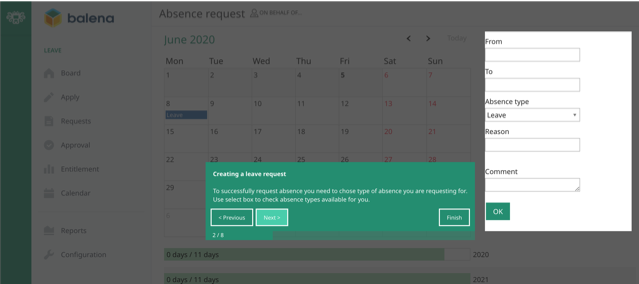
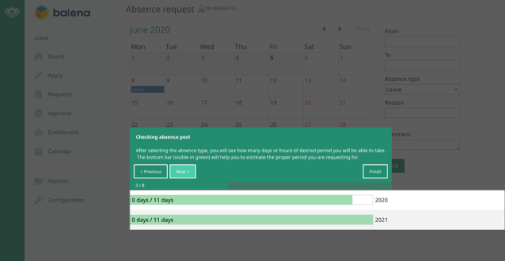
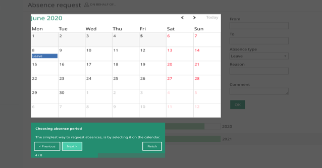
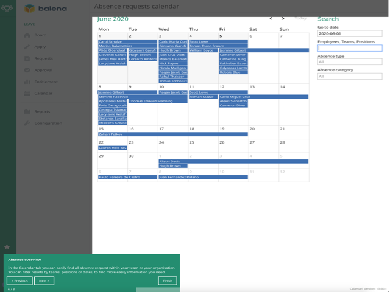
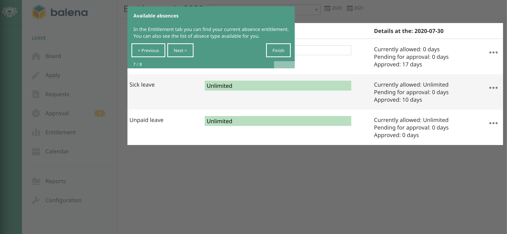

# Calamari
Here’s a guide of how-to-use the main features of our time-off service Calamari.

Our full Leave policy can be found [here](../policies/leave-policy.md)

At first, you can [log in](https://balena.calamari.io/o/sign-in) with your @balena.io e-mail account, using the Google login option.

To request time-off just press “Request absence” then check out the following screenshots.

## First step

To successfully request an absence you need to choose a type of absence. 
Use the drop-down menu to check the absence types. **Leave** is from your bank of leave days for when you are on holiday, wanting to take a break etc. **Sick leave** is, obviously, the absence type you should choose when sick.

## Second step

After selecting the absence type, you will see how many days or hours of chosen absence you will be able to take. It will help you estimate the proper period you are requesting. You can request full or half days.

## Third step

The simplest way to request time off is by marking the requested period and by selecting it on the calendar. 

## Fourth and last step

When requesting more than 2 consecutive days of leave (this does not apply for sick & emergency leave) you are required to assign a substitute (cover).

## My requests

This is the menu option which allows you to check the status and the history of your requests.

## Balena absence overview

Here you can easily find all absence requests of the team. You can filter results by teams, positions or dates, to find the information you need. 

## Personal available absence time (leave allowance)

At the “entitlement” option, on the left side menu, you will always find your current absence allowance. Please note that the first green bar in the screenshot that is not fully visible is your annual leave bank. 

## Time-off calendar

Note that you should be able to see all approved time-off days, for all team members, at your @balena.io e-mail calendar. You should have Calamari under the `others calendars section` in your google calendar. 

## Support

For whatever reason, if you need any help with Calamari, feel free to reach out to the Operations team. Calamari is still a young and small startup and they offer exceptional support to their customers. They already implemented features we requested and they’re happy to do even more for us.
