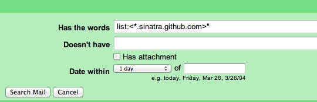

# GitHub

At balena, we’re heavy GitHub users. If you’re a developer, you’ll be using GitHub on a daily basis for several reasons, and there are times when GitHub can be “noisy”.

Before you start, you should have access to the following organizations, in no particular order:

- https://github.com/balena-io: Our storefront. Should only have top-level components of balena.io or other projects we want to be associated with, such as Etcher or Pine.js.
- https://github.com/balena-io-modules: Dependencies of our top-level components. Moved here to reduce the number of repositories in the balena organization.
- https://github.com/balena-io-playground: Anything we want to store here is fine: work in progress, experiments, or crazy ideas. However, nothing should depend on these projects and there should be no guarantee that the links will be stable or that the repo will be there tomorrow. Make sure not to advertise any of these repos, and not to link them to production services.
- https://github.com/balenalabs: Projects we recommend users try on balena.
- https://github.com/balena-os: balena operating system and device support related repositories.
- https://github.com/balenaltd: Home of your personal repository.
- https://github.com/balena-io-library: Balena base images only.
- https://github.com/balena-io-examples: Examples of various implementations of concepts using balena, including our hello-world repositories.
- https://github.com/balenablocks: Home of all our balenaBlocks.
- https://github.com/product-os: Tooling for building products and home to Jellyfish.
- https://github.com/company-os: Tooling for running a company.
- https://github.com/people-os: Tooling for managing a team.

Note that you’ll receive as many invites as the GitHub organizations you are requested to join.

## Filtering notifications

We’ve found it really useful to filter the notifications we receive in our inboxes.

:::info

Email notifications for Issues, Pull Requests, and Gists can easily be filtered by the List-ID header. Look for this header value to sort your notifications, or even forward them to a more appropriate email account. You can filter on `*.org.github.com` to filter out emails by organization, or `REPO.org.github.com` to filter out emails from a specific repo.

:::

## Email notifications routing

You can choose which orgs’ emails to receive to which inbox by visiting `GitHub` > `Settings` > `Notifications` > `Email notification preferences` > `Custom routing`. Try sending all company related notifications to your `@balena.io` inbox. You can also check out [this guide](https://help.github.com/articles/about-email-notifications/) about email notifications and GitHub.

## Unwatch repos

Did you know that you can automatically unwatch the repos that you don’t work on directly? This way, you’ll only get notifications on mentions and assigned issues or PRs. Open the repo you’d like to unwatch and click the Unwatch button which is next to the Star button.

If you’d like to automatically unwatch all new repos, go to `GitHub` > `Settings` > `Notifications` > `Automatic watching` and uncheck the "Automatically watch repositories" option.

Note that unwatch shouldn’t mean ignore. Especially if you choose to automatically unwatch the new repos, make sure to manually watch those that are related to your job and your tasks.

In addition, you can unsubscribe from notifications from a PR thread at the bottom of the right hand menu for that particular PR.

If you find you need to unsubscribe from a lot of repos in bulk, this [GitHub subscriptions list](https://github.com/notifications/subscriptions) may help.

## Resources

Not all balenistas will be familiar with GitHub, so here are some resources that balenistas have found helpful, whether it is to get you started or dive into specific areas.

In case you’re not familiar with git and GitHub, we suggest following GitHub's [Hello World guide](https://guides.github.com/activities/hello-world/). Otherwise, if you are comfortable with using the command line follow [git - the simple guide](http://rogerdudler.github.io/git-guide/), [bitbucket guide](https://www.atlassian.com/git/tutorials/setting-up-a-repository) or [git magic](http://www-cs-students.stanford.edu/~blynn/gitmagic/index.html). We also recommend [setting up an SSH key for GitHub](https://docs.github.com/en/authentication/connecting-to-github-with-ssh/adding-a-new-ssh-key-to-your-github-account) if you don't have one already.

### More resources

- [On undoing, fixing, or removing commits in git](http://sethrobertson.github.io/GitFixUm/fixup.html)
- [GitHub secrets](https://github.com/blog/967-github-secrets)
- [Git guides in other languages](https://github.com/firstcontributions/first-contributions)
- [Git Cheat Sheet](https://www.git-tower.com/learn/cheat-sheets/git/)
