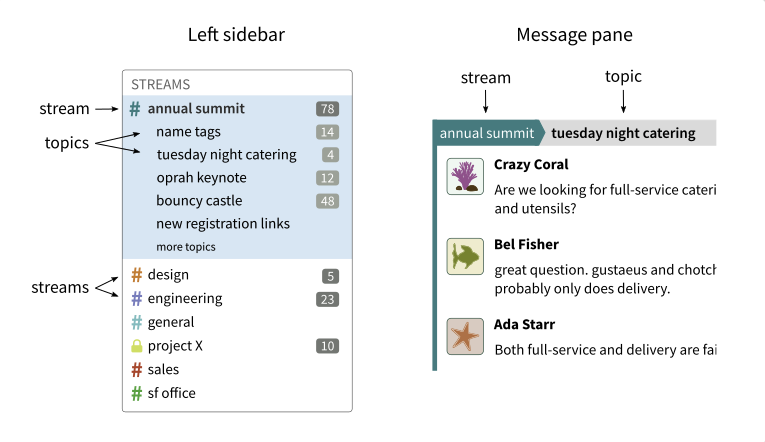
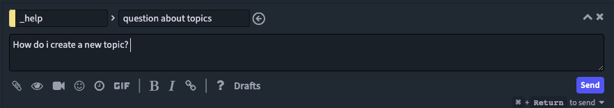

# Zulip

:::info

Please note that as we move across from Jellyfish comms to Zulip, there will be functionality missing from Zulip. This is a best effort for now but we'll continue to update this section of the handbook as the move progresses. **Please flag any questions / issues / things of note in the `Help with Zulip` topic within the `#_help` stream in Zulip.**

:::

**Go to this URL to sign up to the Balena Zulip org.** This should give you moderator access.

https://balena.zulipchat.com/join/svywbhmpmlx4zxk7wr3cbcxv/

You can authenticate with your balena google account.

Balena Zulip URL: https://balena.zulipchat.com

## Zulip for Mobile and Desktop

Zulip is available on both iOS and Android for mobile, and macOS, Windows, Linux and Terminal. You can find links to each version [here](https://zulip.com/apps/)

## Getting Started Guide for Zulip

The [Zulip ‘Help Center’](https://zulip.com/help/) offers lots of useful documentation and information on how to use the platform.

You can find the [getting started guide here.](https://zulip.com/help/getting-started-with-zulip)

:::note

Please set your `full name` under your profile to your github handle rather than your full name. You can change this under your personal settings. Go to the cog icon in the top right corner, select `personal settings` > `profile`.

:::

We've cherry picked some key features to detail below to get you started.

### Notifications and pings

You can view more information about [notifications](https://zulip.com/help/pm-mention-alert-notifications) in zulip in the help center - under the `notifications` heading in the left hand menu.

#### Adding yourself to or creating user groups (aka ‘group pings’)
User groups allow you to mention multiple users at once. When you mention a user group, everyone in the group is notified as if they were individually mentioned. We have added the most popular user groups to get us started so please go ahead and add yourselves to the ones that are relevant.

:::note
User groups are not the same as group private messages. If you’re trying to send a message to a group of people, you can either create a steam or send a group private message.
:::

[You can find out how to create, modify and delete user groups here](https://zulip.com/help/user-groups)

#### User Group Pings
User group pings in Zulip are global! So regardless of the stream you are in, the whole group will be pinged (different to Flowdock where you had to add people to a flow first and then create the ping group for each flow).

#### User mentions
`@` allows you to ping a user and trigger a notification.

#### Silently mention a user
A silent mention allows you to refer to a user without triggering a notification to them. Silent mentions start  with `@_` instead of `@`. A good example of using this is when you want to reference a team member’s involvement in something but it’s not necessary to get their attention.

#### Alert words
Alert words allow you to be notified as if you were `@-` mentioned directly when certain words or phrases are used in Zulip. These are not case sensitive. You can add these under your personal settings. Go to the cog icon in the top right corner, select `personal settings` > `alert words`.

### Streams and Topics

In Zulip, streams determine who gets a message and topics tell you what the message is about. In terms of hierarchy, topics sit within streams. 

:::tip

In Flowdock terms: `Topic = Thread` and `Stream = Flow`

:::

You can view more information about [Streams](https://zulip.com/help/getting-your-organization-started-with-zulip#create-streams) in zulip in the help center.

You can view more information about [Topics](https://zulip.com/help/starting-a-new-topic) in zulip in the help center.

Topics are light-weight subjects, very similar to the subject line of an email. Like in email or a forum, messages about the same topic are shown together as a conversational thread. Here is what it looks like in Zulip.

Topics allow for lots of conversations to happen in the same stream at the same time

Every message has a topic. Topics keep conversations easy to follow, and make it easy to reply to conversations that start while you are offline.

#### Creating topics
You should create a new topic when you start a new conversation. Topic names should also be brief and specific e.g. ‘question about topics’ ‘welcome to Joe bloggs!’ ‘Product OS arch brainstorm 28/09/22’

Go to the Stream you want to create a topic in, and select `new topic` from the bottom on the Zulip window.

:::note

If you start creating a new topic / message in a specific stream and move to a new one, the stream you initially selected will remain persistent. If you want to change the stream you want to post in, you’ll need to cancel the topic / message and start a new one.

:::

### Private Messages

If you want to speak to someone privately on a 1-to-1 basis you can do so by using private messages. 

:::tip

These also get referred to as private threads in the Zulip documentation and UI occasionally. 

Private threads equate to private messages. 

:::

You can create a private message either by

By clicking directly on a username in the right hand ‘Users’ list and typing a message to them.
Go to `private messages` inbox in left hand menu, select `new private message` in the bottom right, and add a user name (or names for a group private message) in the `To:` field. 

:::note

Please only use group private messages if absolutely necessary e.g. in the case of personal or sensitive information being used.

Transparency and open comms should always be the default where possible. Visibility is key for successful async working.
:::

Equally you can view your private messages from the `private messages` inbox in the left hand menu (this will give you a thread / topic like view), or by clicking directly on the user name of the person in the `Users` list (so you can view the 1-to-1 with a single user). 
